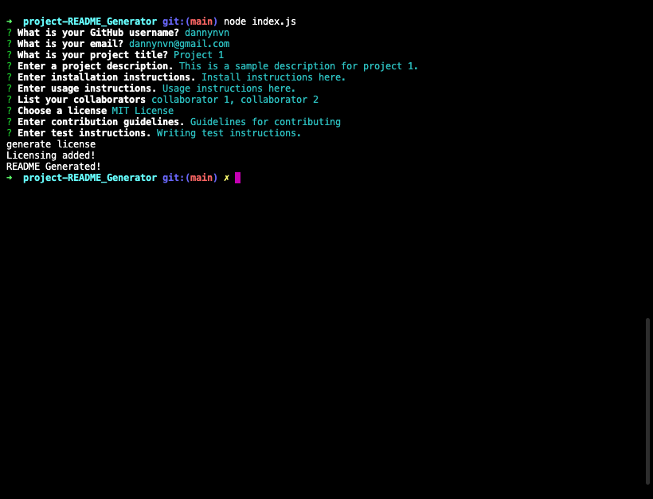
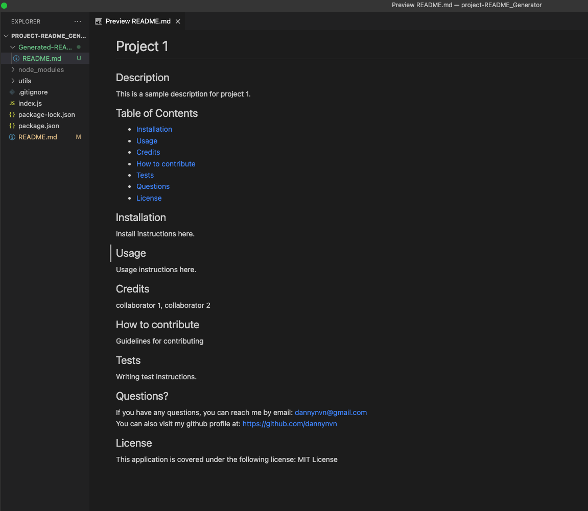

# README Generator

## Description
This application is a README generator built using JavaScript and Node.

## Usage
This application includes the following functionality:
- User is prompted with questions pertaining to README's content
- Generates a README file after user inputs are complete

## Installation
Inquirer version 8.2.4 is required for this application to function correctly.

## Video
https://watch.screencastify.com/v/jeqwayGOotiCyxbxFrlp

## Screenshots

